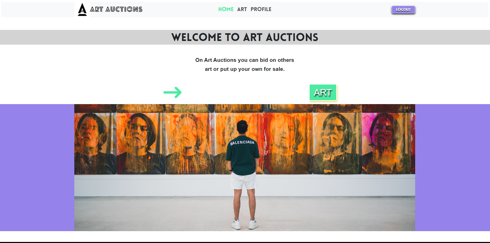

# ART AUCTIONS

# Goal

This is my Semester Project 2. A Front End assignment for users to Register, Login, create an entry and bid on others entry.
To take the skills learned over the past three semesters and create an auction website.

# Brief
An auction site is looking to launch a website where users can add items to be bid on and bid on items other users have put up for auction.

When a new user joins the website, they are given 1000 credits to use on the site. They can get credits by selling items and use credit by buying items. Non-registered users can search through the listings, but only registered users can make bids on listings.

# Requirements
All API functionality is managed by an existing application. This project only covers the front-end application for the API.

API
The API you are using for this project can be found under Auction EndPoints in the Noroff API documentation.

# Resources
API Swagger

User stories
The client has specified the following requirements in the form of User Stories:

A user with a stud.noroff.no email may register
A registered user may login
A registered user may logout
A registered user may update their avatar
A registered user may view their total credit
A registered user may create a Listing with a title, deadline date, media gallery and description
A registered user may add a Bid to another user’s Listing
A registered user may view Bids made on a Listing
An unregistered user may search through Listings
Technical restrictions
The company CTO has set the following technical restrictions:

Must use an approved CSS Framework
Must be hosted on an approved Static Host
Must use an approved Design Application
Must use an approved Planning Application
Required links
The Product Owner has requested links to the following:

A Gantt chart for project timing
A design prototype
A style guide
A kanban project board
A repository link
A hosted application demo link
Approved resources
This list covers libraries and services that have been vetted by the company and approved for use.

CSS processors
SASS/SCSS
PostCSS
CSS frameworks
Bootstrap (version >5.0.1)
Tailwind (version >3.0.0)
MUI (version >5.11.8)
Hosting services
GitHub Pages
Netlify
Design applications
Adobe XD
Figma
Sketch
Planning applications
Trello
GitHub Projects

# Rescources I have used w/links

Trello :  https://trello.com/b/40tBeBos/project-parts
An overview of the projects parts and the progress of each one.

Adobe XD: https://trello.com/b/40tBeBos/project-parts
Design Guide and Prototype for the Website.

Font Awsome: https://fontawesome.com/
Icons used on the website, with snippets in HTML files.

Canva: https://canva.com
Where I designed the company logo. (link to my personal page "https://www.canva.com/design/DAFiKE0p1GI/V7pp1o9RDkGWmjaE9C65ZA/edit?analyticsCorrelationId=c0fcecf8-fef5-4094-a3be-c09a95ef5945")

Gantter:https://cloud.gantter.com/ganttercloud/#fileID=4e92ec75f95343c6841f3101090e5413&amode=cloud
Gantt chart for the projects process.

API: https://docs.noroff.dev/auctionhouse-endpoints/authentication
We used this API provided from the school.

## Process

First i needed to establish the target audience, the type of auction site and from there decide on the design for the logo, colours etc, so that they would meet the target audience.
I started first to design a style guide and a protype in adobe XD. I chose to target people in the ages 25-45 that likes quite modern and expressive art. There fore I decided to go for a minimalistic wbsite that made the user focus quickly and make it easier for them to create a profile, login and create or bid on an entry as quick as possible. 
The coolours I chose where purple, white, black, with yellow and light green as contrast colours. On the front page I made use of an image depicting art that the target audeince will like and lots of white space so the register and login buttons are easy to spot and get the users attention. Alot of modern art and design use white and black, they are also timeless. The purple signals wealth and exclusivety. The green I used on the buttons as they stand out from the website and will be easy to spot.
In the choosing of colours I made sure that the colours follow WCAG and are apporvedfor the colourblind.

I have had alot of things happening in my life and I suffer from exaustion from my previous workplace. In addition to that the personal life has its toll and make it tough to get everything done in time. Also I am very new to coding so I tend to use alot of time fixing issues that may not be so timeconsuming but they are hard for me to spot, so therefore I use alot of time learning what I have done wrong and fixing them.

There are some items in this assignment that I wasnt able to fix in time. They are creating and Entry, searching through entries if not registered and the bidding on entries. I have created the function that calls and displays an array of all entries on the Art-page, but it is not possible to search through them. In the corresponding JS file there is a onkey up event that I trid to use in order to make a search. In that I can log that the keys are ppressed but it wont let me loop through the array and display the entries with a title that correspod to the searchbar.
I created a function that makes it possible for a logged in user to type in info and create an entry, but I'm not sure if it gets created as I can't serach for it. But the user gets a message that it is created.

As a small note in the end:
I have not been able to use Ghantchart as much, since it is both new to me and I prefer o use the Trello board instead. Because of my health I have been focusing on using the time to finish the project using the Trello board and there fore I have forgot to use ghantt chart. I will instead set up the chart to display what I would do if I used it.

##Running the project

First you click on the green code-button and then open the project in GitHub-desktop. Clone it to your local device and then open it in VS-code or your coding software of choice. Type and install "npm i" in the terminal, then open the project locally in your browser by enter "npm run watch" and then press the "Go live" button below the terminal (in VS code). The project will now open as a new tab in your web browser. Now you can freely explore the website.

##Contact

If you want to ask me any questions or otherwise want to get in touch, you can contact me on my email: audunroald@gmail.com.
